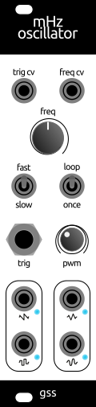

# mHz oscillator
6HP Eurorack module

Voltage Controlled LFO

### Render
 

### Input
- **trig cv**: regular gate
- **freq cv**: non-exponentiated frequency control

### Pots
- **freq**: 30mHz to 30 Hz
- **pwm**: duty cycle of square wave

### Switches
- **speed**: `up` = fast, `down` = slow
- **mode**: `up` = loops around, `down` = stops after one cycle (retrigger)
- **trig**: manual (re)trigger

### Output
All 4 basic waveforms with indicator LED in the range of 0-5V

## Footprints Libraries
Use provided submodule folder to link footprints locally in the project
- OS_Connectors
- OS_Scribbles
